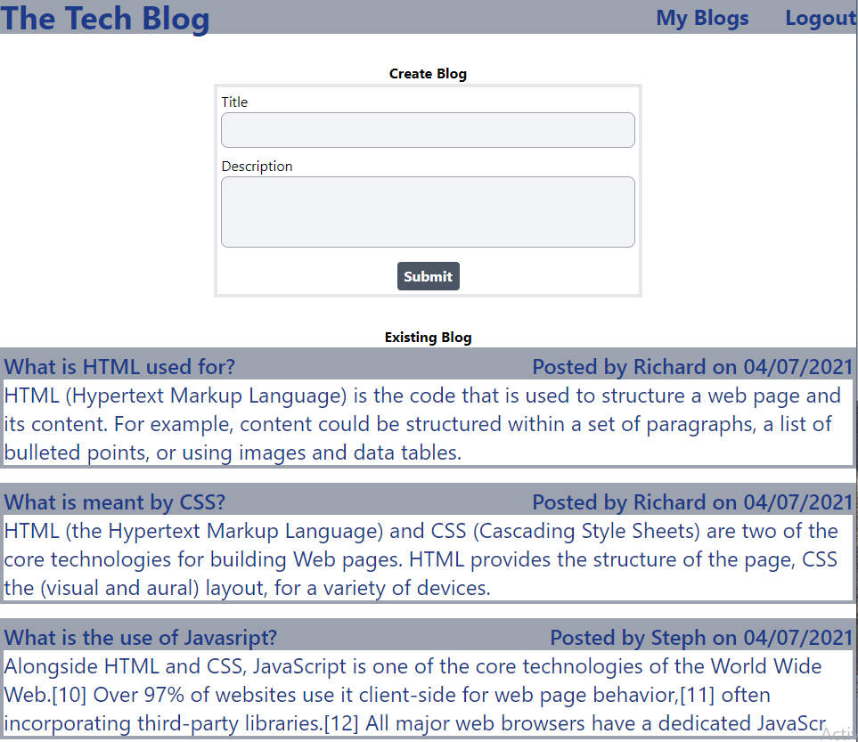

# TechBlogHa

This application allows you to make posts, edit posts and comment on posts.

# Table of Contents
  * [Licence](#Licence)
  * [GitHub Site](#GitHub_Site)
  * [ScreenShot](#ScreenShot)
  * [Technology Used](#Technology_Used)
  * [Usage](#Usage)
  * [Questions](#Questions)

# Licence
licenseBadge = 

licenselink = https://opensource.org/licenses/MIT

# Deployed_Site
https://techblogha.herokuapp.com/

# GitHub_Site
https://github.com/RichoHa/techBlogHa

# ScreenShot

# Technology_Used
-   dotenv
-   connect-session-sequelize
-   dotenv
-   express
-   express-handlebars
-   express-session
-   bcrypt
-   Mysql2
-   sequelize

# Questions
 If you have any queries, please email me on Richard.dqh@gmail.com